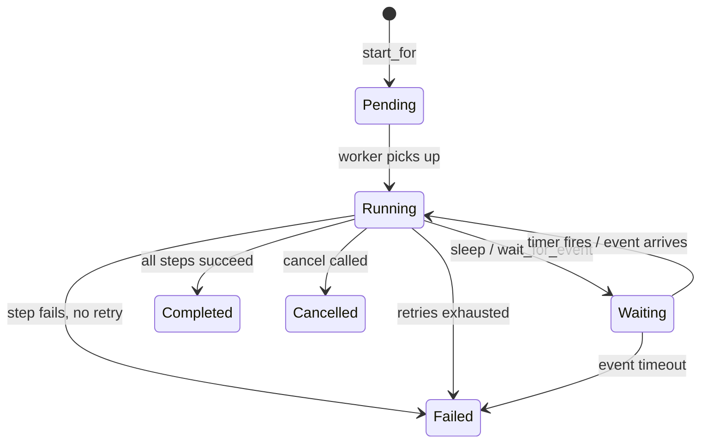

import { Aside } from '@astrojs/starlight/components';

## What Is Durable Execution?

Durable execution lets you write long-running workflows as ordinary async Rust code. Each step is checkpointed to the database. If your process crashes, times out, or gets redeployed, Zart resumes from the last successful step — no work is lost, no step is repeated.

Think of it like GitHub Actions: your workflow has multiple steps, and if the infrastructure fails mid-run, it resumes where it left off. No one configures durability as a non-functional requirement — it's just how the platform works. Zart brings that same default-reliable experience to your Rust backend.

```
Step 1: send_email    ──✓── persisted
Step 2: charge_card   ──💥── crash here
Step 3: send_receipt
─────────────────────────────
Restart → Step 1 is SKIPPED (cached)
        → Step 2 is SKIPPED (cached)
        → Step 3 runs → done
```

## The Rust API Layers

Zart's Rust API is organized into three layers that build on each other. You can use all three together, or drop down to a lower layer when you need more control.

```
┌────────────────────────────────────────────────────────────────┐
│  Macro Layer       #[zart_durable]  #[zart_step]               │
│  (zart-macros)     Ergonomic async fn → DurableExecution       │
│                      Standalone step functions                 │
├────────────────────────────────────────────────────────────────┤
│  Free Functions    zart::step  zart::schedule  zart::wait      │
│  (zart)            zart::sleep  zart::wait_for_event  …        │
│                    All workflow operations — no ctx threading   │
├────────────────────────────────────────────────────────────────┤
│  Scheduler Layer   Scheduler  DurableScheduler  Worker         │
│  (zart + backend)  PostgreSQL polling via SKIP LOCKED          │
└────────────────────────────────────────────────────────────────┘
```

### Scheduler Layer
Responsible for persisting and claiming executions. Implements `SKIP LOCKED` polling so multiple workers can run concurrently without coordination.

| Type | Role |
|---|---|
| `Scheduler` | Trait — poll for due tasks, mark complete/failed |
| `DurableScheduler` | Trait — schedule new executions, deliver events |
| `PostgresScheduler` | Concrete — PostgreSQL backend |
| `Worker` | Drives the poll loop, dispatches to `TaskRegistry` |

### Free Functions Layer
All user-facing workflow operations are free functions under the `zart::` namespace. There is no `ctx` to thread through your code — the framework uses task-local storage to make the current execution context available wherever you are in the call stack.

### Macro Layer
Optional. The `zart-macros` crate provides proc-macros that transform an ordinary `async fn` into a full `DurableExecution` implementation, removing the boilerplate of the trait impl.

| Macro | Purpose |
|---|---|
| `#[zart_durable]` | Marks an async fn as a durable workflow |
| `#[zart_step]` | Turns an async fn into a step struct with `impl ZartStep` |

## Quick Example

```rust
use zart::prelude::*;
use zart::{zart_durable, zart_step};

// One attribute turns a plain async fn into a durable step.
#[zart_step("send-email", retry = "exponential(3, 2s)")]
async fn send_email(email: &str) -> Result<(), StepError> {
    mailer.send(email, "Welcome!").await
}

#[zart_step("setup-billing")]
async fn setup_billing(email: &str) -> Result<String, StepError> {
    billing.create_customer(email).await
}

// The workflow body looks like ordinary async Rust.
// Every .await? is a durable checkpoint — results are persisted,
// and a crashed process resumes exactly where it left off.
#[zart_durable("onboarding", timeout = "10m")]
async fn onboarding(data: OnboardingData) -> Result<(), TaskError> {
    send_email(&data.email).await?;        // durable, with retries
    setup_billing(&data.email).await?;    // durable
    Ok(())
}
```

No new invocation syntax, no context objects to thread through your code. `send_email` and `setup_billing` look and feel like plain async functions — they just happen to be durable. Add `#[zart_step]`, call them normally, and Zart handles persistence, replay, and retries.

```rust
// Register and start a worker
#[tokio::main]
async fn main() -> anyhow::Result<()> {
    let scheduler = PostgresScheduler::connect(&std::env::var("DATABASE_URL")?).await?;

    let mut registry = TaskRegistry::new();
    registry.register("onboarding", Onboarding);

    let worker = Worker::new(scheduler.clone(), registry, WorkerConfig::default());

    // Schedule an execution
    DurableScheduler::start_for::<Onboarding>(&scheduler, "run-1", "onboarding", &OnboardingData { /* ... */ }).await?;

    // Run the worker (blocks until shutdown signal)
    worker.run().await
}
```

<Aside type="tip">
In most applications the scheduler is shared via `Arc<dyn DurableScheduler>` so both the web server (scheduling) and the worker (executing) share the same instance.
</Aside>

## How to Trigger a Workflow

Every durable execution is identified by a **unique execution ID** that doubles as an idempotency key. Calling `start_for` with the same ID twice is safe — the second call returns `ExecutionAlreadyExists` so you can wait on the existing execution instead of creating a duplicate.

```rust
use zart::prelude::*;
use zart::scheduler::DurableScheduler;

let durable = DurableScheduler::new(scheduler.clone());

// Schedule a new execution (idempotent)
durable
    .start_for::<OnboardingTask>("signup-user-42", "onboarding", &OnboardingData {
        email: "alice@example.com".into(),
    })
    .await?;
```

You trigger executions from anywhere — a web handler, a CLI command, a background job. The scheduler and the worker share the same PostgreSQL backend, so they can run in the same process or on separate machines.

## How to Wait for Results

### `wait_completion<T>` — block and deserialize

The simplest way to wait for a result. Blocks until the execution finishes, then deserializes the output to `T`.

```rust
let output: OnboardingOutput = durable
    .wait_completion("signup-user-42", Duration::from_secs(60), None)
    .await?;

println!("Done: {:?}", output);
```

If the execution doesn't finish within the timeout, `wait_completion` returns `WaitTimedOut`. Deserialization errors are surfaced as `SchedulerError::Deserialization`.

### `start_and_wait_for<H>` — start and wait in one call

For the common case where you start an execution and immediately wait, use `start_and_wait_for`. It infers input and output types from the handler type:

```rust
let output = durable
    .start_and_wait_for::<OnboardingTask>(
        "signup-user-42",
        "onboarding",
        &OnboardingData { email: "alice@example.com".into() },
        Duration::from_secs(60),
    )
    .await?;
// output: OnboardingOutput — inferred from OnboardingTask::Output
```

### `wait_for<H>` — wait with handler-inferred types

When you started an execution earlier and now want the typed result without manual deserialization:

```rust
let output = durable
    .wait_for::<OnboardingTask>("signup-user-42", Duration::from_secs(60))
    .await?;
// output: OnboardingOutput — inferred from OnboardingTask::Output
```

### `status` — check without blocking

```rust
let record = durable.status("signup-user-42").await?;
println!("Status: {:?}", record.status);
// ExecutionStatus::Pending | Running | Completed | Failed | Cancelled
```

### `cancel` — stop a running execution

```rust
let cancelled = durable.cancel("signup-user-42").await?;
```

A cancelled execution stops at its next scheduling point. Steps currently running will finish, but no new steps will be scheduled.

## The Lifecycle



1. **Schedule** — `start_for` inserts a row in `zart_executions` with status `pending`.
2. **Claim** — Workers poll PostgreSQL with `SELECT … FOR UPDATE SKIP LOCKED`. Exactly one worker owns one execution.
3. **Run** — The handler body executes. Each step call checks the database:
   - **Hit** — stored result deserialized and returned; the step logic is never called again.
   - **Miss** — the step runs, the result is persisted, then returned.
4. **Complete** — the handler returns `Ok`; status becomes `completed` and the output is stored.
5. **Fail** — the handler returns `Err`; after retries are exhausted, status becomes `failed`.

## Idempotency Guarantee

The execution ID is your idempotency key. If the same user signs up twice due to a double-click, the second `start_for` call returns `ExecutionAlreadyExists` — you detect this and simply wait on the existing execution.

```rust
match durable.start_for::<OnboardingTask>(&exec_id, "onboarding", &input).await {
    Ok(_) => println!("New execution started"),
    Err(SchedulerError::ExecutionAlreadyExists(_, _)) => {
        println!("Already running, waiting on existing…");
    }
    Err(e) => return Err(e.into()),
}

// In all cases, wait on the execution and get typed output
let output: OnboardingOutput = durable
    .wait_completion(&exec_id, Duration::from_secs(60), None)
    .await?;
```

## Next Steps

- [**Steps**](/concepts/steps/) — define and compose durable work
- [**Flow Control**](/concepts/flow-control/) — parallel steps, sleeps, and events
- [**Error Handling**](/concepts/error-handling/) — the three-way outcome model


