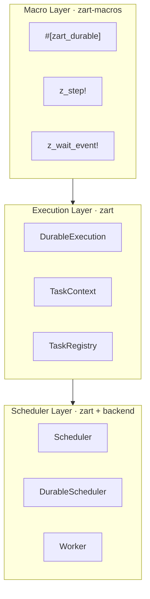

import { Aside, CardGrid, Card } from '@astrojs/starlight/components';

Zart's Rust API is organized into three layers that build on each other. You can use all three together, or drop down to a lower layer when you need more control.

## The Three Layers



### Scheduler Layer

Responsible for persisting and claiming executions. Implements `SKIP LOCKED` polling so multiple workers can run concurrently without coordination.

| Type | Role |
|---|---|
| `Scheduler` | Trait — poll for due tasks, mark complete/failed |
| `DurableScheduler` | Trait — schedule new executions, deliver events |
| `PostgresScheduler` | Concrete — PostgreSQL backend |
| `Worker` | Drives the poll loop, dispatches to `TaskRegistry` |

### Execution Layer

Where your workflow logic lives. A `DurableExecution` receives a `TaskContext` and calls methods on it to execute durable steps.

| Type | Role |
|---|---|
| `DurableExecution` | Trait you implement — defines `Data`, `Output`, `run` |
| `TaskContext` | Passed into `run` — the API for steps, sleep, events |
| `TaskRegistry` | Maps task name strings to `DurableExecution` instances |
| `RetryConfig` | Per-step retry policy (none / fixed / exponential) |
| `TaskError` | Error type for workflow failures |

### Macro Layer

Optional. The `zart-macros` crate provides proc-macros that transform an ordinary `async fn` into a full `DurableExecution` implementation, removing the boilerplate of the trait impl.

| Macro | Purpose |
|---|---|
| `#[zart_durable]` | Marks an async fn as a durable workflow |
| `z_step!` | Executes a named, persisted step |
| `z_step_with_retry!` | Step with inline retry config |
| `z_wait_event!` | Durably waits for an external event |
| `z_durable_loop!` | Stateful loop with persistent iteration counter |

## Quick Example

```rust
use zart::{DurableExecution, TaskContext, TaskError, TaskRegistry, Worker, WorkerConfig};
use zart::{DurableScheduler, RetryConfig};
use zart_postgres::PostgresScheduler;
use async_trait::async_trait;
use std::time::Duration;

// 1. Implement DurableExecution
struct MyWorkflow;

#[async_trait]
impl DurableExecution for MyWorkflow {
    type Data   = MyInput;
    type Output = MyOutput;

    async fn run(
        &self,
        ctx: &mut TaskContext,
        data: MyInput,
    ) -> Result<MyOutput, TaskError> {
        let result = ctx.step("step-one", || async {
            do_something(&data).await
        }).await?;

        Ok(MyOutput { result })
    }
}

// 2. Register and start a worker
#[tokio::main]
async fn main() -> anyhow::Result<()> {
    let scheduler = PostgresScheduler::connect(&std::env::var("DATABASE_URL")?).await?;

    let mut registry = TaskRegistry::new();
    registry.register("my-workflow", MyWorkflow);

    let worker = Worker::new(scheduler.clone(), registry, WorkerConfig::default());

    // Schedule an execution
    scheduler.schedule("my-workflow", MyInput { /* ... */ }).await?;

    // Run the worker (blocks until shutdown signal)
    worker.run().await
}
```

<Aside type="tip">
In most applications the scheduler is shared via `Arc<dyn DurableScheduler>` so both the web server (scheduling) and the worker (executing) share the same instance.
</Aside>

## Execution Lifecycle

1. **Schedule** — `DurableScheduler::schedule()` inserts a row into `zart_executions` with status `pending`.
2. **Claim** — Worker polls with `SELECT … FOR UPDATE SKIP LOCKED`. One worker owns one execution at a time.
3. **Run** — `DurableExecution::run()` is called. Each `ctx.step()` call checks `zart_steps` for an existing result.
   - **Step hit** — stored result deserialized and returned without calling the closure.
   - **Step miss** — closure is called, result serialized and written to `zart_steps`, then returned.
4. **Complete** — execution status set to `completed`, output stored.
5. **Fail** — if `run` returns `Err`, execution is retried up to `max_retries()`. Final failure sets status `failed`.

## Next Steps

- [DurableExecution Trait](/rust-api/task-handler/) — full method reference for `TaskContext`
- [Macros](/rust-api/macros/) — ergonomic `#[zart_durable]` proc-macro layer
- [Durable Loops](/rust-api/loops/) — iterate over collections durably
- [Parallel Steps](/rust-api/parallel-steps/) — concurrent fan-out with `wait_all`
- [Wait for Event](/rust-api/wait-for-event/) — external signals and human approvals
